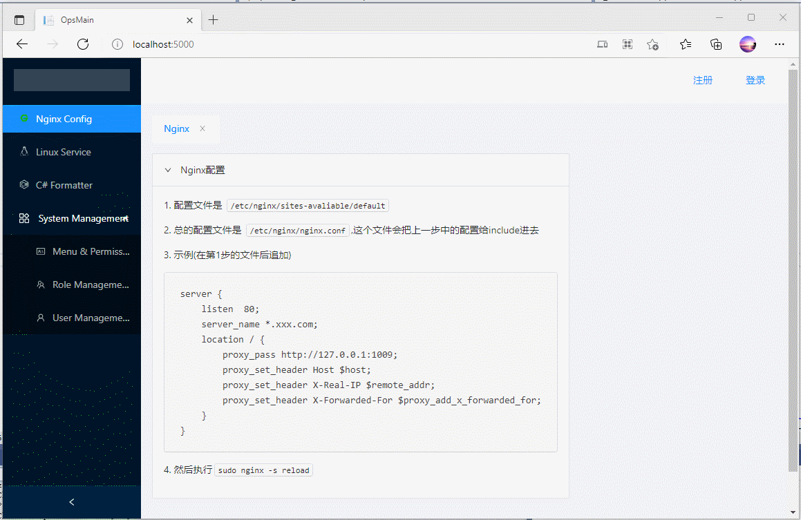

English | [中文](README.zh-cn.md)
# Blazor-Treadstone
A rapid development framework powered by Blazor, front-end and back-end separation, authority authentication with IdentityServer。

With **Treadston** ，you are stand on the shoulders of giants and can quickly build your own system.

Tech stack：
- Frontend：Blazor WASM + Ant Design Blazor
- Backend：ASP.NET Core 5.0
- DataBase：SQL SERVER 2019 + Entity Framework 5.0
- Authentication：IdentityServer


# 1. Project structure
```
├─Blazor
│  ├─OpsMain.Client                 //WASM Client
│  │  
│  └─OpsMain.Server                 //WASM Host
│
├─OpsMain.3rdService                //Backend Service
│
├─OpsMain.IdsAuthentication         //IdentityServer
│
├─OpsMain.Shared                    //Shared Model
│
└─OpsMain.StorageLayer              //Entity Framework

```


# 2. Usage
## 2.1 Create database and Init data
Directly run projects **OpsMain.IdsAuthentication** and **OpsMain.3rdService** 。

After this and without any error prompt, the init operation is done. The default username and password are both `admin`。

## 2.2 Debug and Run

Run those three projects：
- OpsMain.IdsAuthentication
- OpsMain.3rdService
- OpsMain.Server


Scrrenshot：

